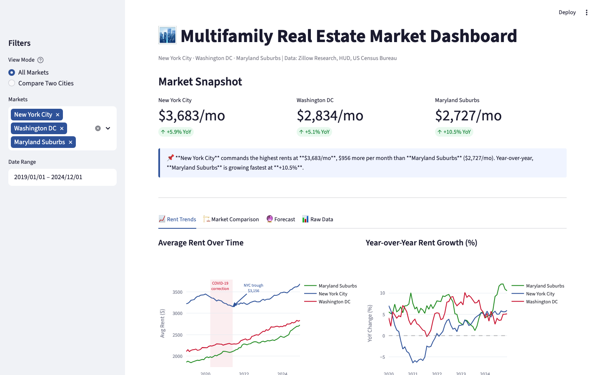
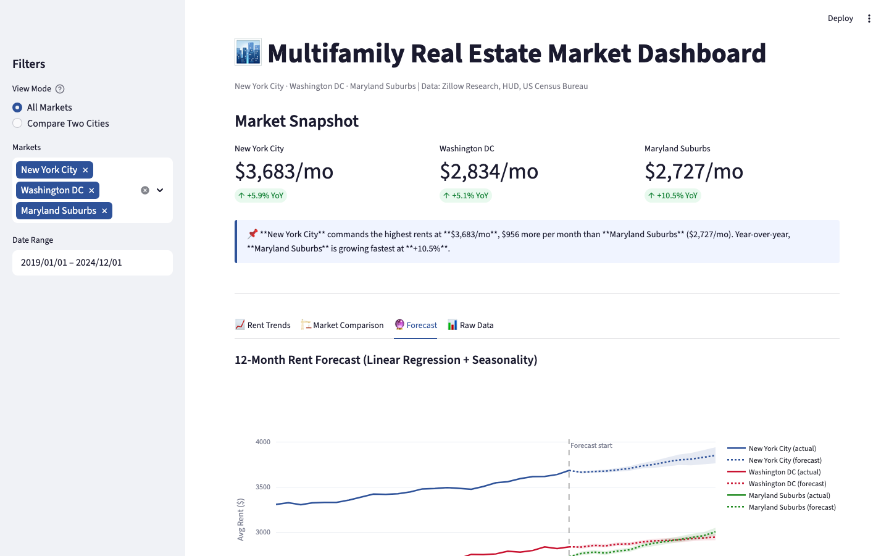
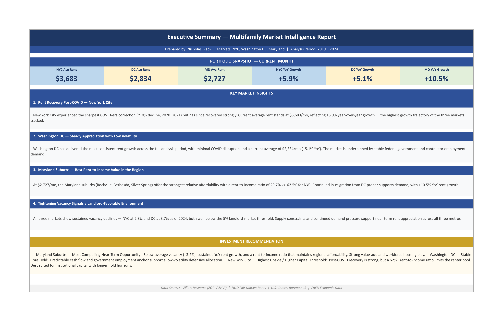

# Real Estate Market Dashboard

> An end-to-end data pipeline and multi-format dashboard analyzing multifamily real estate trends across **New York City**, **Washington DC**, and the **Maryland Suburbs**.

**[🚀 Live Demo →](https://your-app.streamlit.app)** ← *(replace with your Streamlit Cloud URL after deploying)*

---

## Dashboard Preview

<!-- After deploying, replace these with real screenshots -->
<!-- To add: drag images into the /screenshots folder, then update these paths -->

| Streamlit — Market Snapshot | Streamlit — Forecast Tab |
|:-:|:-:|
|  |  |
| *KPI cards, rent trends, callout summaries* | *Prophet forecast with 80% confidence bands* |

| Excel Dashboard — Executive Summary |
|:-:|
|  |
| *4-tab Excel report: KPI snapshot, key insights, investment recommendation* |

---

## What This Project Does

Built to mirror the kind of market intelligence work done in professional real estate environments — pulling public data, cleaning it, storing it in a queryable database, forecasting forward rent levels, and packaging the results into both a live web app and an Excel deliverable.

**Key findings:**
- NYC experienced a ~10% COVID rent correction in 2020–2021 but recovered strongly, now leading YoY growth at +5.9%
- DC shows the most consistent rent appreciation with minimal volatility — stable government employment demand
- Maryland Suburbs have the lowest rent-to-income ratio (29.7%), below the 30% affordability threshold — the most accessible market for workforce tenants
- All three markets have vacancy below 5% (2024), a landlord-favorable signal
- Prophet model projects continued rent growth across all three markets through 2025

---

## Stack

| Layer | Technology |
|-------|-----------|
| Data ingestion | Python `urllib`, Zillow Research public CSVs |
| Cleaning & transformation | `pandas`, `numpy` |
| Database | SQLite — window functions, ranked queries, LAG/LEAD |
| Forecasting | Meta Prophet (trend + yearly seasonality + uncertainty bands) |
| Excel dashboard | `openpyxl`, `matplotlib` PNG-embedded charts |
| Web app | `streamlit`, `plotly` |
| Testing | `pytest` — 21 unit tests covering cleaning logic and model output |
| CI/CD | GitHub Actions — runs tests + pipeline on every push |

---

## Data Sources

- [Zillow Research](https://www.zillow.com/research/data/) — ZORI rent index, ZHVI home values
- [HUD Fair Market Rents](https://www.huduser.gov/portal/datasets/fmr.html) — metro-level benchmarks
- [US Census Bureau ACS](https://www.census.gov/programs-surveys/acs) — median household income
- [FRED Economic Data](https://fred.stlouisfed.org/) — unemployment and population context

---

## Dashboard Pages (Excel)

| Sheet | Content |
|-------|---------|
| **1 - Market Overview** | KPI cards, rent bar chart, trend line with COVID annotation |
| **2 - Rent Trends** | MoM table (color-coded), YoY comparison chart |
| **3 - Market Comparison** | Side-by-side metrics, affordability index, vacancy trend |
| **4 - Executive Summary** | Snapshot KPIs, key insights, investment recommendation |

## Streamlit App Tabs

| Tab | Content |
|-----|---------|
| **Rent Trends** | Historical rent lines (2019–2024), YoY growth, MoM bars — with COVID annotation |
| **Market Comparison** | Rent ranking, affordability index, vacancy trend, vacancy vs. rent growth scatter |
| **Forecast** | 12-month Prophet projection with 80% confidence bands |
| **Raw Data** | Filterable table + CSV download |

---

## How to Run

```bash
# 1. Clone and install
git clone https://github.com/YOUR_USERNAME/real-estate-market-dashboard
cd real-estate-market-dashboard
pip install -r requirements.txt

# 2. Run full pipeline (uses synthetic data if no Zillow CSVs present)
python scripts/run_pipeline.py

# 3. Launch web app
streamlit run app.py

# 4. (Optional) Download real Zillow data first
python scripts/fetch_data.py
python scripts/run_pipeline.py --skip-fetch
```

### Individual steps

```bash
python scripts/clean_data.py       # Clean & transform
python scripts/load_to_sql.py      # Load into SQLite
python scripts/forecast.py         # Run Prophet forecast
python scripts/build_dashboard.py  # Build Excel dashboard
python scripts/query_data.py       # Run SQL analytics queries
```

### Run tests

```bash
pytest tests/ -v
```

---

## Deploy to Streamlit Cloud (free, 2 min)

1. Push this repo to GitHub
2. Go to [share.streamlit.io](https://share.streamlit.io) → connect your repo
3. Set main file path to `app.py` → Deploy
4. Share the live URL on your resume and LinkedIn

---

## Project Structure

```
real-estate-dashboard/
├── app.py                         # Streamlit web app
├── .github/
│   └── workflows/pipeline.yml    # GitHub Actions CI
├── data/
│   ├── raw/                       # Zillow CSVs (gitignored)
│   ├── cleaned/                   # Processed CSVs (gitignored)
│   └── real_estate.db             # SQLite (gitignored)
├── dashboard/
│   └── Real_Estate_Market_Dashboard.xlsx
├── scripts/
│   ├── fetch_data.py
│   ├── clean_data.py
│   ├── load_to_sql.py
│   ├── forecast.py                # Meta Prophet model
│   ├── build_dashboard.py
│   ├── query_data.py
│   └── run_pipeline.py            # Master runner
├── tests/
│   ├── test_clean_data.py         # 14 unit tests
│   └── test_forecast.py           # 7 unit tests
├── .streamlit/config.toml
├── .gitignore
├── requirements.txt
└── README.md
```

---

*Nicholas Black — Real Estate Market Analysis Portfolio Project*  
*Built to apply market intelligence workflows from a professional real estate environment*
